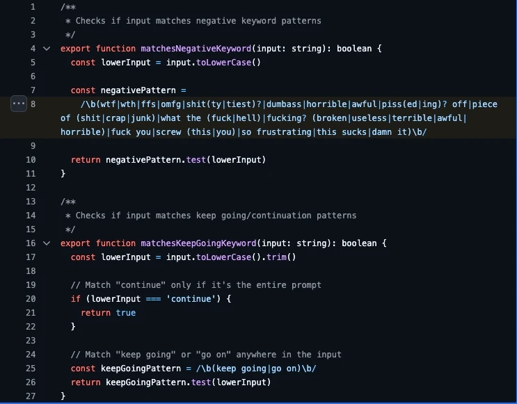

## Vibecoding as a Service

Semana passada, um desenvolvedor da Anthropic fez uma publicação de código meio cagada da ferramenta de CLI (*command line interface*, ou **tela preta** pros leigos) do Claude Code, mandando na leva um arquivo *.map*.

Pra quem não entende de programação em React, esse arquivo faz a ligação entre o *TypeScript* (a linguagem legível por humanos que usamos para criar o código) e o *minified* (a versão "compilada", usada para executar a aplicação em si).
Essa ligação é necessária para que mensagens de erro possam significar algo de útil ao desenvolvedor, sabendo em que linha de código o erro ocorreu, já que a versão minificada é feita de uma única e gigantesca linha de código no arquivo.

Esse aquivo não deveria ser enviado junto com os demais para o repositório público, mas foi.
E como esse arquivo contém, necessariamente, o código em *TypeScript*, [foi possível ter acesso ao conteúdo integral da ferramenta de CLI para desenvolvimento da Anthropic](https://neuromatch.social/@jonny/116325668039992121), o Claude Code.

Foi gerado muito *buzz* sobre esse vazamento, já que foi entregue de bandeja um monte de segredos de indústria pros seus concorrentes e com certeza algumas cabeças rolaram por lá.
Mas meu foco aqui é outro: **arquitetura**.

Pra quem já está no mercado de desenvolvimento há algum tempo, tá cansado de saber que na prática, a teoria é outra.
Saímos de nossos cursos de especialização e graduação preparados com uma carga teórica satisfatória, dominando diversos padrões de *design*, mas na correria da produção diária, o que vale mesmo é **funcionar**.

Cada profissional e entusiasta tem sua própria coleção de opiniões e visões sobre o assunto.
A minha é que, um *pipeline* de produção que não tem tempo pra organizar sua arquitetura, é uma estrutura que aposta no sucesso sem ter cartas na mão.
Você trabalha com um time, você tem um cronograma definido e todo mundo conhece sua parte no trabalho.
Mas você entrega a um profissional de desenvolvimento de *software*, a missão adicional de desvendar enigmas e mistérios sobre como o *software* funciona.
É um barato que sai caro. Você não poupou tempo, você só realocou ele da arquitetura bem documentada e estruturada para a investigação forense de um fluxo de trabalho e regras de negócio.
É uma gestão de ciclo de vida que existe na base do blefe e da sorte. Não é meu perfil. Mas também não é meu perfil passar fome, então a gente adere.

Recentemente [Boris Cherny](https://x.com/bcherny), principal contribuidor do Claude Code, [cravou que 100% das suas "contribuições" são feitas... em Claude Code](https://www.reddit.com/r/ClaudeAI/comments/1pzhv26/claude_code_creator_confirms_that_100_of_his/)!
Parece, tem forma, cheiro e cor de [Basilisco](https://pt.wikipedia.org/wiki/Basilisco_de_Roko), mas é apenas seu primo desempregado.
Não, a tecnologia de IA generativa agêntica de código não vai conseguir, em nenhuma iteração recente, "entender" o que precisa melhorar em si mesmo sozinha, porque esse é um conjunto de valores e princípios humanos mutáveis (somos nós que avaliamos a qualidade segundo critérios pessoais e mutáveis de acordo com nossa observação e a mistura saudável de racionalização e sentimentos) e o agente só tem acesso aos princípios e valores humanos estáticos gravados na *internet*, além de ser incapaz de interpretar nuance (lembre-se: é um modelo probabilístico, ele não sabe o que faz, ele não sabe nada, quem sabe é só você e eu; ele **INTERPRETA**, nem sempre bem). Ele é tão consciente da "resposta certa" quanto você quando chuta uma alternativa em uma prova de múltipla escolha.

## A barriga da besta

Muita mureta colada com durex foi encontrada nesse código. Essa especialmente me diverte.

Eles usam *regex* simples pra detectar sentimentos negativos no prompt do usuário e ativar **guardrails**, diretivas que se interpõem entre o retorno gerado e o usuário pra filtrar comportamento inadequado do modelo, como ensinar a realizar crimes ou auxiliar em abusos.

Olha... Estou trabalhando com [Model Context Protocol](https://modelcontextprotocol.io/docs/getting-started/intro) no momento, que é basicamente "ensinar" o agente de IA a usar ferramentas pra cumprir tarefas. De fato o protocolo impõe uma guia feita basicamente de termos, então a certo ponto faz sentido, mas se eu sou a porra da Anthropic, eu com certeza vou investir numa solução um pouco mais robusta que uma linha xumbrega de *strings* que supostamente resumem todos ou a maioria sentimentos negativos humanos na comunicação. Né? Né? Não sei. O mundo anda caótico demais até pra mim. Certamente uma sugestão feita pelo próprio Claude Code.

Então se você considera isso verdade mesmo e cruza com o vazamento do código, você passa então a entender por que em alguns blocos existe uma diversidade de comentários sobre alterações específicas.
Comentários em linha como "Método não retorna mais *string* truncada e sim completa, independente de *timeout*" e magicamente você passa a saber que, em algum momento do desenvolvimento, retornar strings trucandas ali foi um problema relativo a algum timeout. Os caras não somente abriram mão do segredo de indústria como também da dignidade, expondo até o processo de trabalho dos envolvidos.

Mas notoriamente o que se vê nessa poluição verbosa no código é uma organização louca de regras de negócio, que não necessariamente estão erradas, mas não fazem sentido num contexto de extrema variação de implementações.
A não ser que você gaste alguns milhares de *tokens* ensinando o modelo a aderir de forma estrita a arquitetura que foi previamente criada ali, estamos falando de *freestyle* e *código à moda caralha*.
Mas o pé está atolado no acelerador nas nossas linhas de produção. O concorrente está avançando, grita o chefe, pau na máquina! O resultado é *vibe coding* que, efetivamente, cria código sujo, de leitura humana dificultada e manutenção humana quase impossível.
Ou seja, o futuro dos repositórios de código arriscam perigosamente a serem curados e mantidos por esses mesmos modelos e, em breve, estaremos redigindo dissertações pra eles ao invés de programar.

Se já não estávamos mais priorizando um cuidado sanitário básico com a arquitetura de um sistema, pelo bem do trabalho em equipe ou da veia artística da coisa, agora talvez estejamos próximos de jogar as últimas pás de cal sobre essa cova.
Os modelos de geração de código não tem nenhuma paixão por arquitetura e vão decidir construir estruturas baseadas no problema imediato, o que elas precisam resolver naquele momento, no microcosmos misterioso do contexto que ele criou em seu agente supervisor, sem nenhuma transparência e compatível com a *performance* que o seu plano de uso permite ou limita.

Não há necessariamente demérito em usar o modelo, que de fato tem se provado útil quando o assunto é produtividade em criação de código. Há demérito, claro, em deixar o modelo fazer todo o seu trabalho. Não sei até que ponto podemos julgar esse caso dentro desse parâmetro, mas até certo ponto, foi o que aconteceu ali.